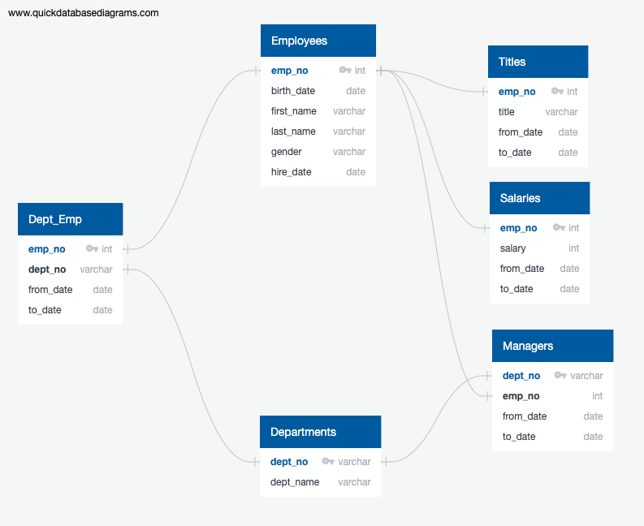
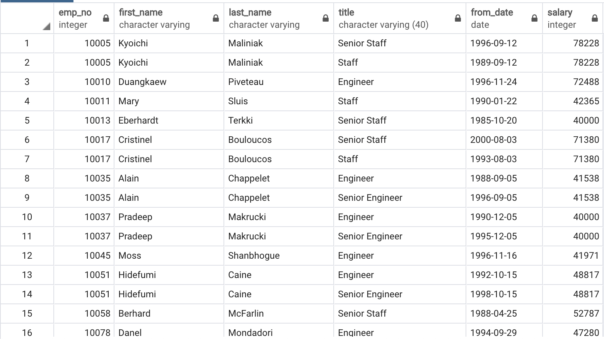
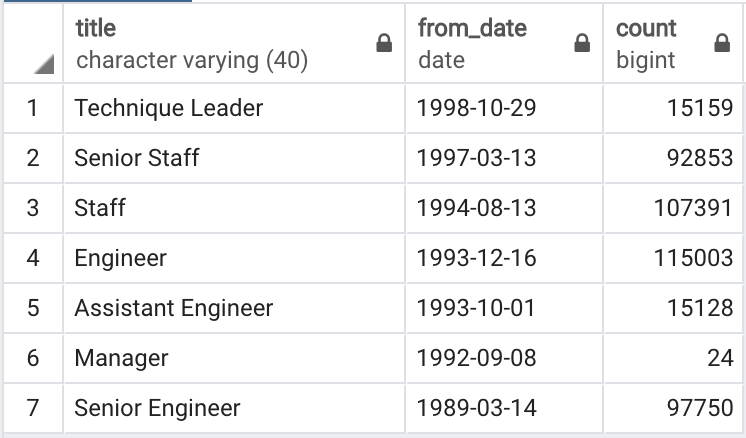
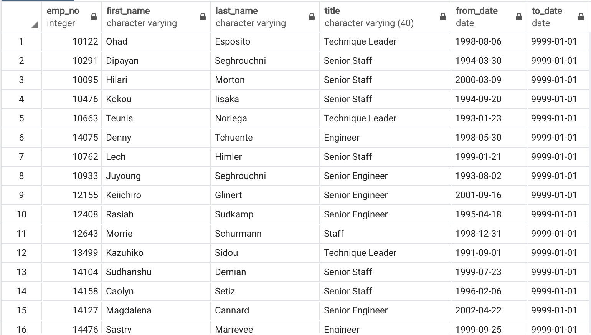

# Pewlett Hackard Analysis

## Project Overview
A company named Pewlett Hackard is offering retirement packages for those employees who meet a certain criteria. It's also looking forward and preparing for the next big wave of retirement. The task is to determine who will be retiring in the next 10 years and how many vacancies there will be.

## Resources
Software:
- PostgresSQL 11.5

## Summary

The `Queries` directory holds 2 `.sql` files containing all queries used for the formation of the tables. 

## Challenge Overview
The HR Director wants a list of candidates for the mentorship program. To create the list it's first necessary to select current employees eligible for retirement and their most recent titles. The director is also interested in seeing how many employees of each title are currently eligible for retirement. 

## Challenge Summary
Retiring Employees with Title:

Title Frequency:

Mentors:
